# SEQUENCE DIAGRAMS — TechStore Microservice

## 1. Đăng Ký Khách Hàng (Register)

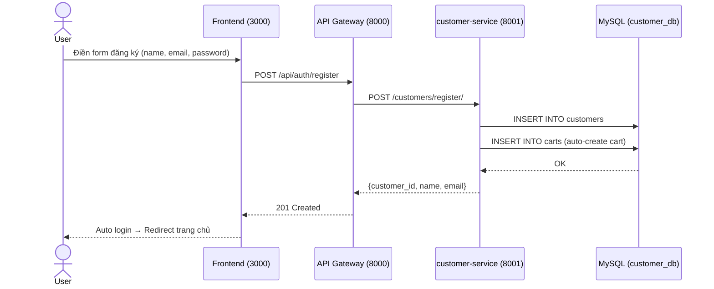

---

## 2. Đăng Nhập Khách Hàng (Login)

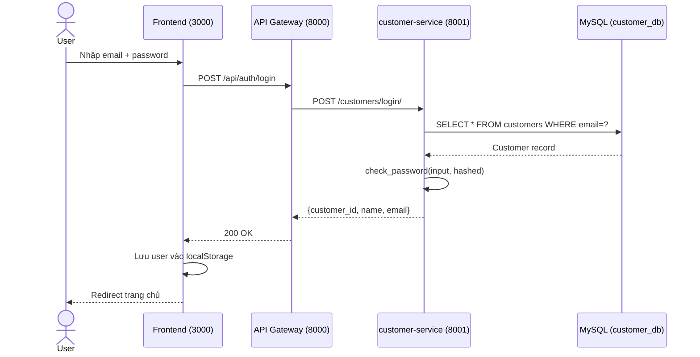

---

## 3. Đăng Nhập Quản Trị (Staff Login)

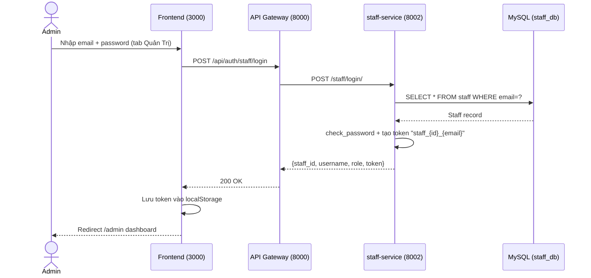

---

## 4. Xem Tất Cả Sản Phẩm (Get All Products)

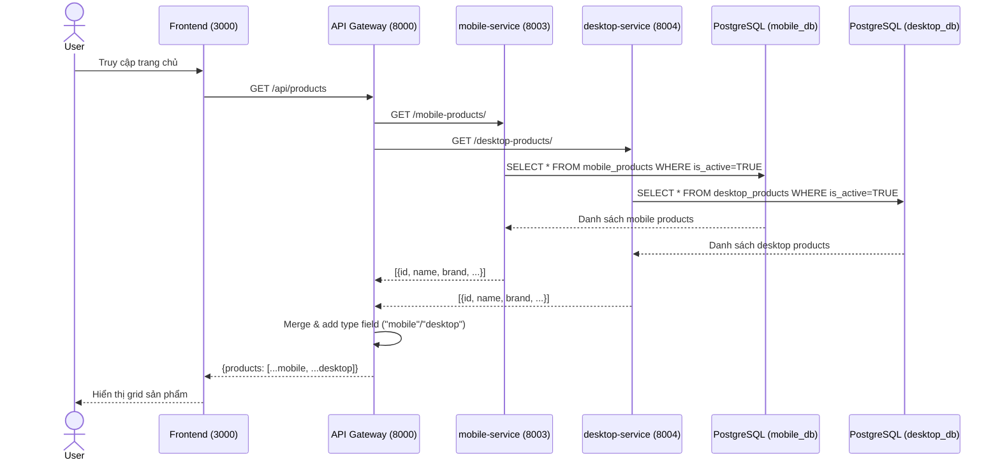

---

## 5. Xem Chi Tiết Sản Phẩm (Product Detail)

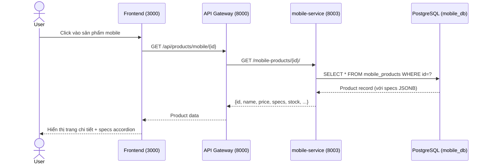

---

## 6. Thêm Sản Phẩm Vào Giỏ Hàng (Add to Cart)

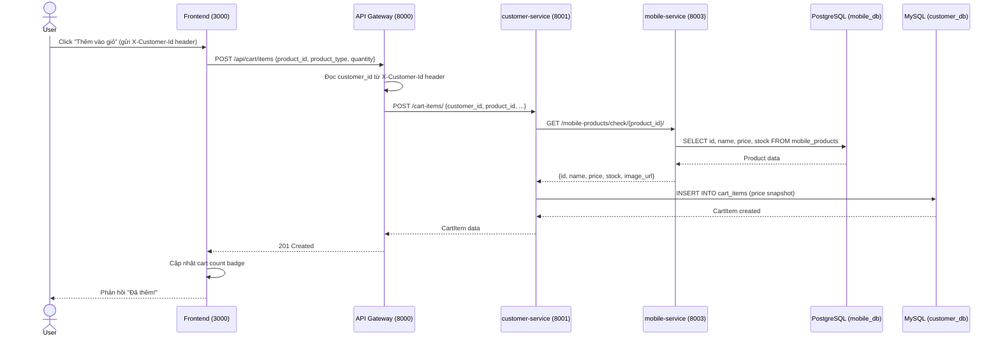

---

## 7. Xem Giỏ Hàng (View Cart)

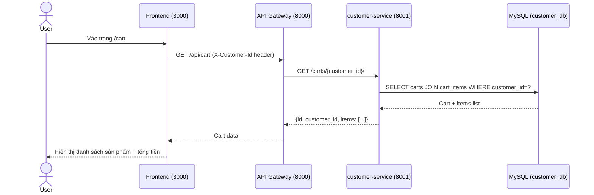

---

## 8. Cập Nhật Số Lượng Giỏ Hàng (Update Cart Item)

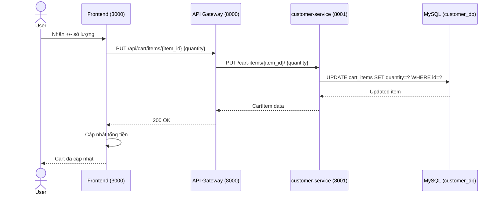

---

## 9. Xóa Sản Phẩm Khỏi Giỏ (Remove Cart Item)

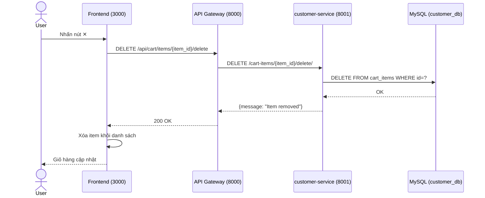

---

## 10. Đặt Hàng / Checkout

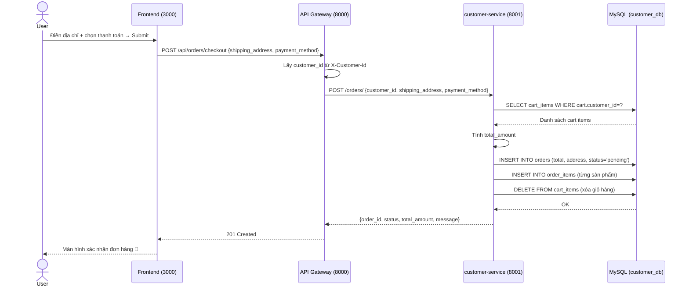

---

## 11. Xem Đơn Hàng Của Tôi (Customer Orders)

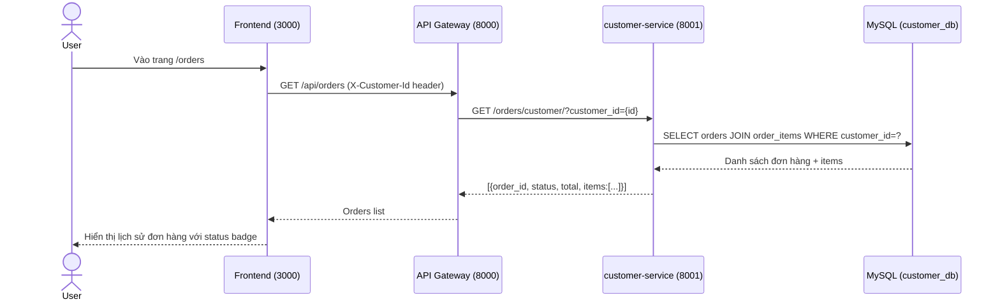

---

## 12. Thêm Sản Phẩm Mới (Admin — Add Product)

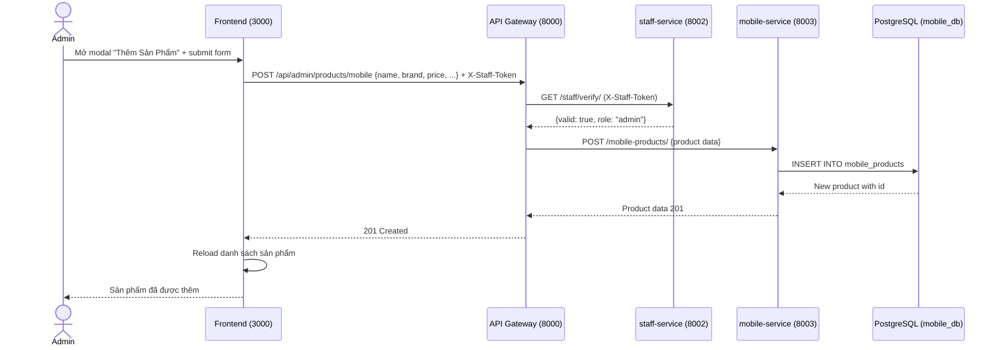

---

## 13. Sửa Sản Phẩm (Admin — Edit Product)

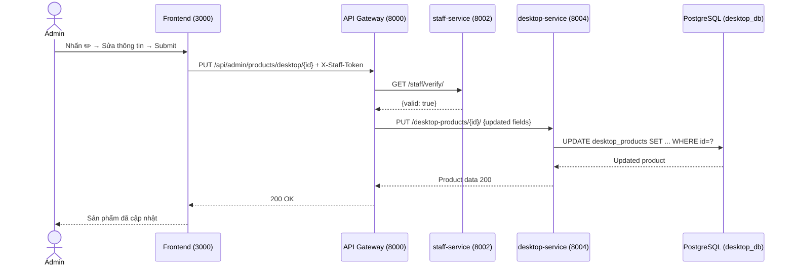

---

## 14. Xóa Sản Phẩm (Admin — Delete Product)

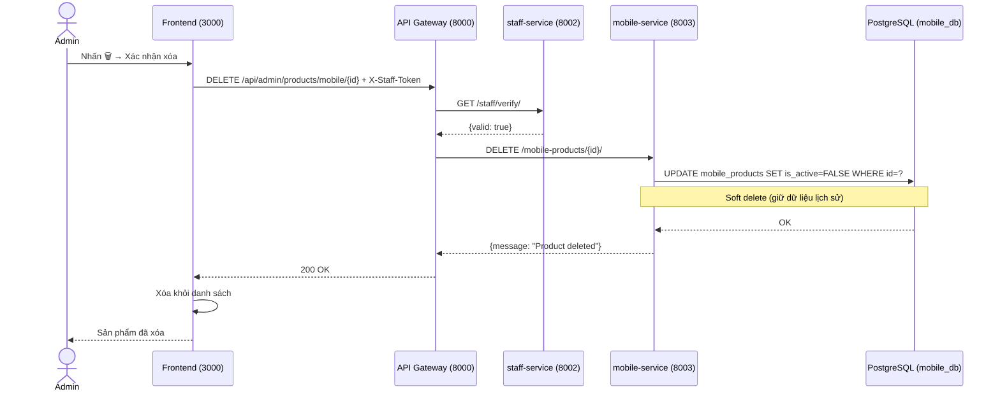

---

## 15. Cập Nhật Trạng Thái Đơn Hàng (Admin — Update Order Status)

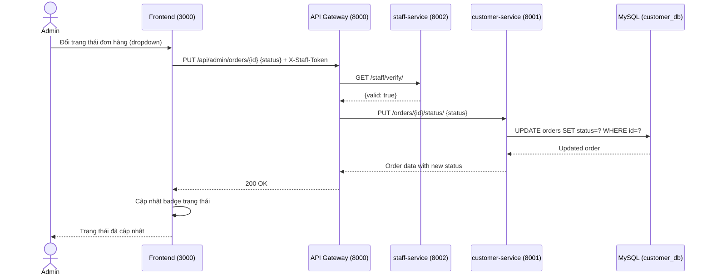

---

## 16. Xem Tất Cả Đơn Hàng (Admin — All Orders)

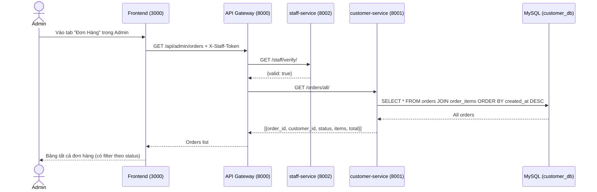
